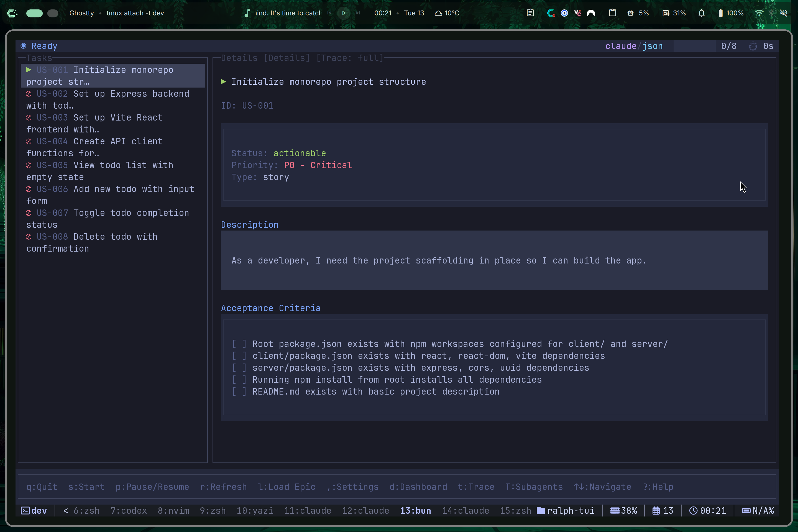

# Rube Goldberg TUI

[](https://www.npmjs.com/package/rube-goldberg-tui)
[](https://opensource.org/licenses/MIT)
[](https://bun.sh)

**AI Agent Loop Orchestrator** - A terminal UI for orchestrating AI coding agents to work through task lists autonomously.

Rube Goldberg TUI connects your AI coding assistant (Claude Code, OpenCode) to your task tracker and runs them in an autonomous loop, completing tasks one-by-one with intelligent selection, error handling, and full visibility.



## Quick Start

```bash
# Install
bun install -g rube-goldberg-tui

# Setup your project
cd your-project
rube-goldberg-tui setup

# Create a PRD with AI assistance
rube-goldberg-tui create-prd --chat

# Run Rube Goldberg!
rube-goldberg-tui run --prd ./prd.json
```

That's it! Rube Goldberg will work through your tasks autonomously.

## Documentation

**[rube-goldberg-tui.com](https://rube-goldberg-tui.com)** - Full documentation, guides, and examples.

### Quick Links

- **[Quick Start Guide](https://rube-goldberg-tui.com/docs/getting-started/quick-start)** - Get running in 2 minutes
- **[Installation](https://rube-goldberg-tui.com/docs/getting-started/installation)** - All installation options
- **[CLI Reference](https://rube-goldberg-tui.com/docs/cli/overview)** - Complete command reference
- **[Configuration](https://rube-goldberg-tui.com/docs/configuration/overview)** - Customize Rube Goldberg for your workflow
- **[Troubleshooting](https://rube-goldberg-tui.com/docs/troubleshooting/common-issues)** - Common issues and solutions

## How It Works

```
┌─────────────────────────────────────────────────────────────────┐
│                                                                 │
│   ┌──────────────┐     ┌──────────────┐     ┌──────────────┐   │
│   │  1. SELECT   │────▶│  2. BUILD    │────▶│  3. EXECUTE  │   │
│   │    TASK      │     │    PROMPT    │     │    AGENT     │   │
│   └──────────────┘     └──────────────┘     └──────────────┘   │
│          ▲                                         │            │
│          │                                         ▼            │
│   ┌──────────────┐                         ┌──────────────┐    │
│   │  5. NEXT     │◀────────────────────────│  4. DETECT   │    │
│   │    TASK      │                         │  COMPLETION  │    │
│   └──────────────┘                         └──────────────┘    │
│                                                                 │
└─────────────────────────────────────────────────────────────────┘
```

Rube Goldberg selects the highest-priority task, builds a prompt, executes your AI agent, detects completion, and repeats until all tasks are done.

## Features

- **Task Trackers**: prd.json (simple), Beads (git-backed with dependencies)
- **AI Agents**: Claude Code, OpenCode
- **Session Persistence**: Pause anytime, resume later, survive crashes
- **Real-time TUI**: Watch agent output, control execution with keyboard shortcuts
- **Subagent Tracing**: See nested agent calls in real-time
- **Cross-iteration Context**: Automatic progress tracking between tasks

## CLI Commands

| Command | Description |
|---------|-------------|
| `rube-goldberg-tui` | Launch the interactive TUI |
| `rube-goldberg-tui run [options]` | Start Rube Goldberg execution |
| `rube-goldberg-tui resume` | Resume an interrupted session |
| `rube-goldberg-tui status` | Check session status |
| `rube-goldberg-tui logs` | View iteration output logs |
| `rube-goldberg-tui setup` | Run interactive project setup |
| `rube-goldberg-tui create-prd` | Create a new PRD interactively |
| `rube-goldberg-tui convert` | Convert PRD to tracker format |
| `rube-goldberg-tui config show` | Display merged configuration |
| `rube-goldberg-tui template show` | Display current prompt template |
| `rube-goldberg-tui plugins agents` | List available agent plugins |
| `rube-goldberg-tui plugins trackers` | List available tracker plugins |

### Common Options

```bash
# Run with a PRD file
rube-goldberg-tui run --prd ./prd.json

# Run with a Beads epic
rube-goldberg-tui run --epic my-epic-id

# Override agent or model
rube-goldberg-tui run --agent claude --model sonnet
rube-goldberg-tui run --agent opencode --model anthropic/claude-3-5-sonnet

# Limit iterations
rube-goldberg-tui run --iterations 5

# Run headless (no TUI)
rube-goldberg-tui run --headless
```

### Create PRD Options

```bash
# Create a PRD with AI assistance (default chat mode)
rube-goldberg-tui create-prd
rube-goldberg-tui prime  # Alias

# Use a custom PRD skill from skills_dir
rube-goldberg-tui create-prd --prd-skill my-custom-skill

# Override agent
rube-goldberg-tui create-prd --agent claude

# Output to custom directory
rube-goldberg-tui create-prd --output ./docs
```

### TUI Keyboard Shortcuts

| Key | Action |
|-----|--------|
| `s` | Start execution |
| `p` | Pause/Resume |
| `d` | Toggle dashboard |
| `i` | Toggle iteration history |
| `u` | Toggle subagent tracing |
| `q` | Quit |
| `?` | Show help |

See the [full CLI reference](https://rube.works) for all options.

### Custom Skills Directory

You can configure a custom `skills_dir` in your config file to use custom PRD skills:

```bash
# In .rube-goldberg-tui/config.toml or ~/.config/rube-goldberg-tui/config.toml
skills_dir = "/path/to/my-skills"

# Then use custom skills
rube-goldberg-tui create-prd --prd-skill my-custom-skill
```

Skills must be folders inside `skills_dir` containing a `SKILL.md` file.

## Contributing

### Development Setup

```bash
git clone https://github.com/subsy/rube-goldberg-tui.git
cd rube-goldberg-tui
bun install
bun run dev
```

### Build & Test

```bash
bun run build       # Build the project
bun run typecheck   # Type check (no emit)
bun run lint        # Run linter
bun run lint:fix    # Auto-fix lint issues
```

### Project Structure

```
rube-goldberg-tui/
├── src/
│   ├── cli.tsx           # CLI entry point
│   ├── commands/         # CLI commands (run, resume, status, logs, etc.)
│   ├── config/           # Configuration loading and validation (Zod schemas)
│   ├── engine/           # Execution engine (iteration loop, events)
│   ├── interruption/     # Signal handling and graceful shutdown
│   ├── logs/             # Iteration log persistence
│   ├── plugins/
│   │   ├── agents/       # Agent plugins (claude, opencode)
│   │   │   └── tracing/  # Subagent tracing parser
│   │   └── trackers/     # Tracker plugins (beads, beads-bv, json)
│   ├── session/          # Session persistence and lock management
│   ├── setup/            # Interactive setup wizard
│   ├── templates/        # Handlebars prompt templates
│   ├── chat/             # AI chat mode for PRD creation
│   ├── prd/              # PRD generation and parsing
│   └── tui/              # Terminal UI components (OpenTUI/React)
│       └── components/   # React components
├── skills/               # Bundled skills for PRD/task creation
│   ├── rube-goldberg-tui-prd/
│   ├── rube-goldberg-tui-create-json/
│   └── rube-goldberg-tui-create-beads/
├── website/              # Documentation website (Next.js)
└── docs/                 # Images and static assets
```

### Key Technologies

- [Bun](https://bun.sh) - JavaScript runtime
- [OpenTUI](https://github.com/anomalyco/opentui) - Terminal UI framework
- [React](https://react.dev) - Component model for TUI
- [Handlebars](https://handlebarsjs.com) - Prompt templating
- [Zod](https://zod.dev) - Configuration validation
- [Prototype Cafe Workflow] (https://prototype.cafe) - Home of the Innovation Station of Lila Inglis Abegunrin
- [Rube Goldburd Machine] (https://rube.works) - Modern Day Chain Reaction AI Agent for Bilding AI Agents


